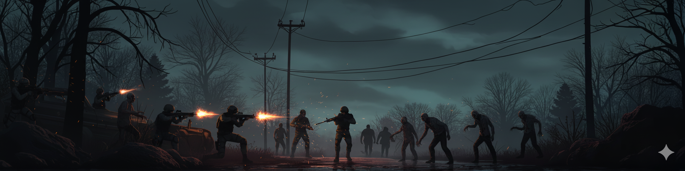
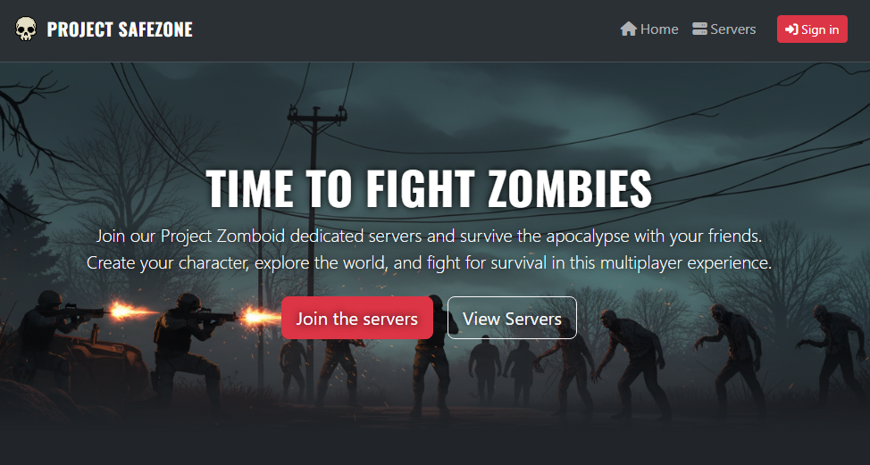
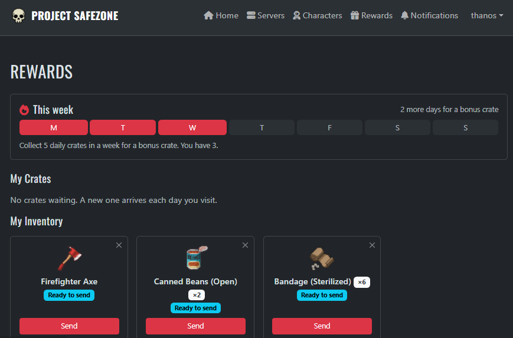
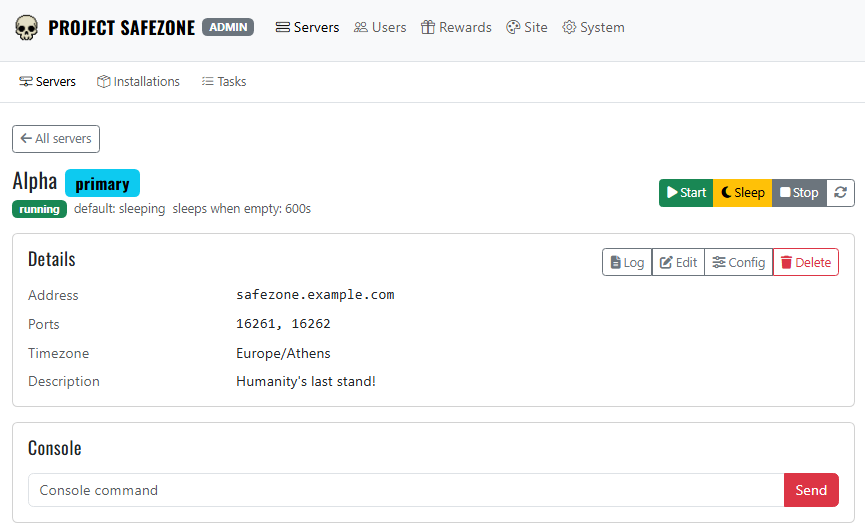
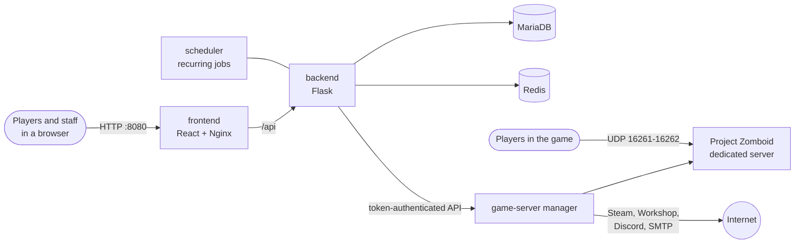

<p align="center">
  
</p>

<h1 align="center">Project Safezone</h1>

<p align="center">
  <strong>A self-hosted web portal for Project Zomboid dedicated servers.</strong><br>
  Player accounts, daily loot delivered straight into the game, and a staff panel that runs your servers from the browser.
</p>

<p align="center">
  <a href="LICENSE"></a>
  
  
  
</p>

<p align="center">
  <a href="#highlights">Highlights</a> ·
  <a href="#quick-start">Quick start</a> ·
  <a href="docs/features.md">All features</a> ·
  <a href="docs/configuration.md">Configuration</a> ·
  <a href="#contributing">Contributing</a>
</p>

---

Project Safezone puts a website in front of your community's Project Zomboid servers. Players sign up, link their in-game characters, and collect loot crates that are delivered into the running game. Staff start, stop and configure servers, install Workshop mods, take backups, moderate players and get alerts in Discord — all from the browser, without an SSH session.

It is free and open source, runs as a single Docker Compose stack, and suits anything from a handful of friends to a public community with a team of moderators. Everything beyond the basics — the loot economy, alerts, invite-only sign-up — is optional.

## Screenshots

<table>
  <tr>
    <td width="50%"></td>
    <td width="50%"></td>
  </tr>
  <tr>
    <td align="center"><em>The public site — your community's front page, under your own name.</em></td>
    <td align="center"><em>Players collect daily crates, track their weekly streak, and send rewards to their character.</em></td>
  </tr>
  <tr>
    <td colspan="2" align="center"></td>
  </tr>
  <tr>
    <td colspan="2" align="center"><em>Staff control each server: start, sleep and stop it, read its log, edit its settings, or use the live console.</em></td>
  </tr>
</table>

## Highlights

- 🎁 **Daily loot, delivered in-game.** Weighted crates, a weekly streak bonus and limited-time events. Rewards go to the player's character, and only count as delivered once the server confirms it — otherwise they return to the player's inventory.
- 🧟 **Characters are claimed, not typed in.** A player proves they own a character by being online with it. No approval queue for staff.
- 😴 **Servers that sleep.** An idle server stops the game but stays in the in-game server browser, and starts again when someone tries to join. Several servers can share one modest machine.
- 🧩 **Workshop mods without the pain.** Paste a mod or collection URL, preview it, install it once for every server, and be told when the load order is wrong.
- 🛠️ **Your servers, from the browser.** Install and update the game, start and stop servers, use the console, read logs, edit the settings, and take or restore world backups.
- 🛡️ **Moderation with a paper trail.** Roles, timed bans that reach the game, player reports and ban appeals, and an audit log of every sensitive action.
- 🔔 **Alerts where your staff already are.** Discord, email, or a feed in the panel — each choosing which events it hears.
- 🔐 **Built for a public server.** Two-factor sign-in, closed / password / invite-only registration, a captcha, data export and account deletion, and a backend with no internet access at all.

See **[all features](docs/features.md)** for the full tour.

## Recommend Host Specs

- **A Linux host on x86-64 (amd64)** with **Docker**. Docker Desktop on Windows or an Intel Mac is fine for trying it out.
- **Memory**: 8 GB is comfortable for one game server; 4 GB will run a small one. The game gets half of the available memory (1–8 GB), and the rest of the stack needs about 1 GB.
- **Disk**: about 10 GB for the game, plus your worlds, mods and backups.
- **CPU**: 2 cores work; 4 or more let the game use a better garbage collector.
- **Network**: outbound internet for Steam downloads, and inbound **UDP 16261–16262** if players outside your network will connect.

Developed against **Project Zomboid Build 42**.

## Quick start

**1. Get the code**

```bash
git clone https://github.com/GramThanos/Project-Safezone.git
```

```bash
cd Project-Safezone
```

**2. Create your settings**

```bash
cp .env.example .env
```

Open `.env` and replace the four secrets — `SECRET_KEY`, `DATABASE_PASSWORD`, `DATABASE_ROOT_PASSWORD` and `API_TOKEN` — with long random values. This prints one:

```bash
openssl rand -hex 32
```

Set `TZ` to your timezone while you are there (e.g. `Europe/Berlin`). Do this *before* the first start: the database passwords are only read when the database is created.

**3. Start the stack**

```bash
docker compose up -d
```

The first build takes a few minutes. Follow it with `docker compose logs -f` if you like.

**4. Sign in and change the admin password**

Open <http://localhost:8080> and sign in as `admin` / `admin`. That account can do nothing except change its own password until you do.

**5. Install the game**

Go to **Admin → Servers → Installations** and click **Install game**. SteamCMD downloads the dedicated server — several GB, so allow some minutes. Progress shows under **Tasks**.

**6. Create and start a server**

Under **Admin → Servers**, add a server:
- give it the **hostname** players will connect to (your public domain or IP) and its ports (`16261,16262`)
- set its **timezone**
- tick **Primary** so its clock decides when the daily loot resets

Start it, and watch the first boot under **Log**. The first boot creates the world, which takes a while.

**7. Join**

In Project Zomboid, open **Join**, add the server's address and port `16261`, and connect. Then claim your character on the website under **Characters** while you are in-game.

**8. Set up loot**

Under **Admin → Rewards → Loot Boxes**, fill each box's pool — **Import config → Community** gives you a ready-made starting set. *A box with an empty pool cannot be opened*, so do this before inviting players.

## Before you open it to the internet

The defaults are meant for a machine only you can reach. Work through this list before sharing the address.

- [ ] **All four secrets changed** in `.env` (step 2 above), and the `admin` password changed.
- [ ] **HTTPS in front.** The stack serves plain HTTP on port 8080. Put a reverse proxy that terminates TLS in front of it — with [Caddy](https://caddyserver.com), this is the whole configuration:
  ```
  zomboid.example.com {
      reverse_proxy localhost:8080
  }
  ```
  Then set the **Site URL** under **Admin → System → Settings** to `https://zomboid.example.com`, so links in emails and invitations point to the right place.
- [ ] **Only the right ports published.** By default only the website (`8080`) and the game (`16261-16262/udp`) are reachable; the API, database and cache stay on an internal network. With a proxy on the same machine, bind 8080 to localhost only ([how](docs/configuration.md#changing-the-published-ports)).
- [ ] **Registration decided.** Sign-up is open by default. Closed, shared-password and invite-only are under **Admin → System → Settings**.
- [ ] **Email set up**, or accept that password resets become your job — without `SMTP_HOST`, recovery mail only goes to the backend log. See [Configuration](docs/configuration.md#env).
- [ ] **Moderators chosen carefully.** A moderator can type any command into a server's console. Every command is audited, but the role is a real trust decision. [What each role can do.](docs/features.md#what-each-role-can-do)
- [ ] **Two-factor turned on** for your admin account, from its profile page.
- [ ] **Rules and privacy pages written** under **Admin → Site → Pages**.

## Running it

### Upgrading

Back up first (see below), then:

```bash
git pull && docker compose build && docker compose up -d
```

Database migrations run automatically when the backend starts.

### Backups

Everything worth keeping lives in Docker volumes, not in the repository folder.

| Volume | Holds | Losing it means |
|---|---|---|
| `db_data` | Accounts, characters, loot, audit log | Every account and all loot history is gone |
| `game_data` | Game data, including world saves | The worlds are gone |
| `game_backups` | World archives taken from the panel | Your restore points are gone |
| `game_files` | The game install and downloaded mods | A re-download, nothing more |

**Worlds** are backed up from each server's page in the panel, which flushes the running server to disk first and can restore an archive later. Archives can be downloaded from there too, or copied off the host in one go:

```bash
docker compose cp game-server:/backups ./backups-export
```

**The database** is separate and needs its own backup:

```bash
docker compose exec -T db sh -c 'exec mariadb-dump -uroot -p"$MYSQL_ROOT_PASSWORD" "$MYSQL_DATABASE"' > safezone-db.sql
```

And to restore it:

```bash
docker compose exec -T db sh -c 'exec mariadb -uroot -p"$MYSQL_ROOT_PASSWORD" "$MYSQL_DATABASE"' < safezone-db.sql
```

### Logs and health

```bash
docker compose logs -f backend scheduler game-server
```

Each game server's own log is readable from the panel. `GET /health` reports the database, cache and game-server manager separately.

## Configuration

`.env` holds only the secrets, the timezone and mail. Everything you may want to change while running — registration, invitations, loot, mail, the site's name and text — is in the admin panel and applies without a restart. Details in **[docs/configuration.md](docs/configuration.md)**.

## How it works



Six containers on one host. The **backend** owns accounts, characters and the loot economy; the **game-server manager** owns the servers, the game install and the console. The backend asks the manager to do things, never the other way round. Only the manager can reach the internet — the backend, which holds the accounts, has no outbound access at all.

Module layout and the conventions that keep the two halves apart are in [AGENTS.md](AGENTS.md).

## Disclaimers

This software is still in alpha version. The initial architecture was prepared by a human and AI is been used for powering the core development. At the current state, features are still tested and finetuned, and AI generated code is still under review. Thus, bugs are expected and AI slop may still exist inside the code.

## Contributing

Contributions are welcome — code, documentation, bug reports, and especially **community presets**: loot boxes and server templates that other communities can import in one click. To share one, export it from your panel, add the JSON file to [`community/`](community) with an entry in that folder's `list.json`, and open a pull request. Code conventions and the architecture are described in [AGENTS.md](AGENTS.md).

**Questions, bugs and ideas:** [open an issue](https://github.com/GramThanos/Project-Safezone/issues).

## Credits

- Item names and icons in the item picker come from [PZwiki](https://pzwiki.net)'s item list.
- The game-server image is built on [cm2network/steamcmd](https://github.com/CM2Walki/steamcmd).

Project Safezone is a community project. It is not affiliated with or endorsed by The Indie Stone. Project Zomboid, its name and its artwork belong to The Indie Stone.

## License

[GNU General Public License v3.0](LICENSE).
